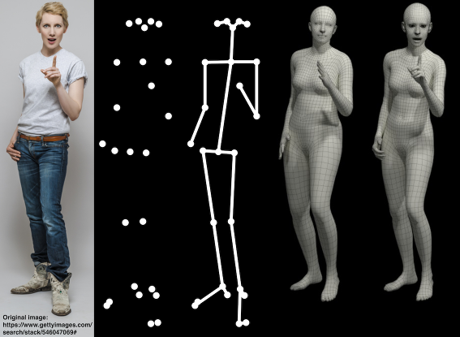

# SMPL-X Tensorflow (SMPLX_TF)

SMPL-X Tensorflow module

SMPL-X for tensorflow pipelines. This is a tensorflow port of the [original SMPL-X](https://github.com/vchoutas/smplx) expressive human parametric model. 

#### **Requirements:**

**Needed:**
Python3,
Pickle,
Numpy,
Tensorflow

**Optional:**
Trimesh,
Pyrender

Run the `quick_run.py` to test your install. It loads a random human with an interactive 3D-visualization.

Download SMPL-X model files as per instructions in [SMPLX-project page](https://smpl-x.is.tue.mpg.de/)

For merging SMPL+H with [MANO](https://mano.is.tue.mpg.de/) or to remove chumpy objects follow [this](https://github.com/vchoutas/smplx/tree/master/tools).

For downloading SMPL gender based models (i.e male, female) follow [this](https://smpl.is.tue.mpg.de/), for gender neutral model follow [this](http://smplify.is.tue.mpg.de/).

**Do consider clicking the star button for the project if this repository was useful in your work.**

For License please check original SMPL-X repository [here](https://github.com/vchoutas/smplx).